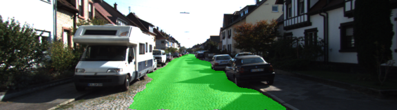
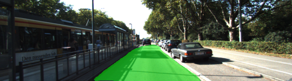

# Segmantic Segmentation

The goal of this project was to create a fully connected neural network that can differentiate between road and non-road parts in an image. The network and training data were already provided, it was just putting the pieces together and choosing some parameters for the training phase. I chose the following parameters:
- Epochen: 50
- Learning rate: 0.0005
- Batch size: 5
- Keeping prob.: 0.5

Below you can see a few sample images that have been evaluated by the network, the results are looking pretty decent for most of the images.

